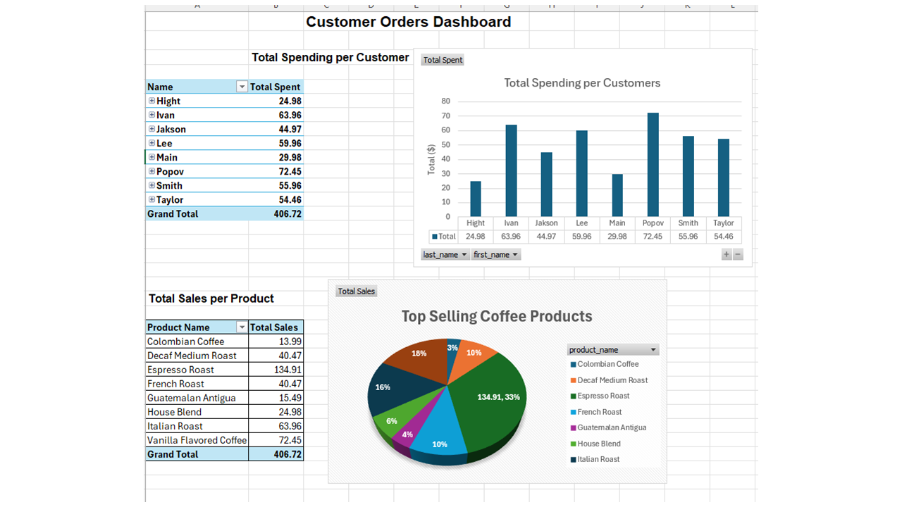

# ☕ SQL + Excel: Online Coffee Store Analysis

This project simulates an online coffee store and demonstrates how to combine SQL for data analysis and Excel for data visualization.  
It walks through creating a database, writing queries, and building a simple dashboard to track customer behavior and sales.

---

## 🗂 Project Structure

### 1. `OnlineStore_SQL_Project.sql`
- Creates a database: `OnlineStore`
- Builds 3 tables: `Customers`, `Products`, `Orders`
- Inserts sample data (customers, coffee products, and orders)
- Includes SQL queries:
  - Total spending per customer
  - Orders with total amount greater than $50
  - Update customer contact information

### 2. `CoffeeSales_ExcelDashboard.xlsx`
- Data exported from SQL
- Merged into one table using `VLOOKUP`
- Created pivot tables:
  - Total Spending per Customer
  - Total Sales per Product
- Designed charts and formatted dashboard on a single sheet

### 3. `CoffeeDashboard_Preview.PNG`
- Preview image of the final Excel dashboard

---

## 📸 Dashboard Preview

---

## 💡 Skills Practiced

- **SQL**: database creation, `JOIN`, `GROUP BY`, `WHERE`, `UPDATE`
- **Excel**: pivot tables, `VLOOKUP`, data formatting, charts
- **Dashboarding**: visual summary on a single sheet

---

## 🎓 What I Learned

This project helped me strengthen my SQL fundamentals and practice analyzing customer purchase data.  
I also learned how to prepare clean datasets for Excel and build a visual dashboard that summarizes key business metrics.

---

## 📝 Notes

This is a beginner-friendly project, perfect for showcasing basic SQL and Excel skills in a job interview or portfolio.
